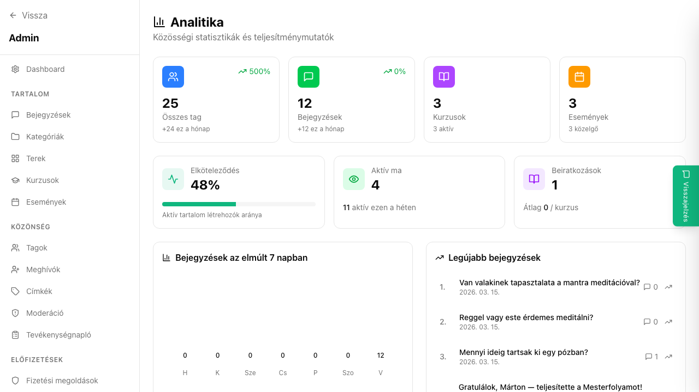

## Mi ez?

Az analitika dashboard egy helyen mutatja meg, hogyan teljesít a közösséged. Nyomon követheted a tagok számának alakulását, a tartalom-aktivitást, a kurzus beiratkozásokat és az eseményeken való részvételt – mindent heti vagy havi bontásban.

Az analitika az `/admin/analytics` oldalon érhető el. Csak adminok látják.

## Lépésről lépésre

1. Lépj be az admin felületre, és kattints a bal oldali menüben az **Analitika** pontra (vagy navigálj közvetlenül az `/admin/analytics` oldalra).
2. Az oldal tetején válaszd ki az időszakot: **heti** vagy **havi** nézet.
3. Tekintsd át a főbb mutatókat:
   - **Tagszám trend** – hány új tag csatlakozott az adott időszakban
   - **Bejegyzések aktivitása** – mennyi új bejegyzés és komment született
   - **Kurzus beiratkozások** – melyik kurzusokra iratkoztak fel a tagok
   - **Esemény részvétel** – hány tag RSVP-zett az eseményekre, és ténylegesen részt vett
   - **Elkötelezettségi mutatók** – lájkok, reakciók, aktív tagok aránya
4. Az egyes szekciókra kattintva részletesebb bontást láthatsz (pl. melyik tartalom teljesített a legjobban).
5. Ha egy adott időszak kiugró értéket mutat, vesd össze a tartalom-naptárral – valószínűleg egy kiemelt bejegyzés vagy esemény mozgatta meg a számokat.

## Tippek

- Az analitikát **heti rendszerességgel** érdemes megnézni, nem csak havonta – így hamarabb észreveszed, ha valami nem működik.
- A **beiratkozási arány** (kurzusoknál) jó jelzőszám arra, hogy a tartalmaid elég vonzóak-e.
- Az adatok **nem exportálhatók** közvetlenül CSV vagy Excel formátumba – ha részletes riportot kell készítened, a számokat manuálisan kell kimásolni.
- Ha a tagszám stagnál, de az aktivitás nő, az jó jel: a meglévő tagok elkötelezettebbekké válnak.
- A **heti aktív tagok** mutatója megbízhatóbb egészségi jelző, mint a teljes tagszám.

## Kapcsolódó cikkek

- [Tagkezelés](../tagkezeles)
- [Kurzusok kezelése](../kurzusok)
