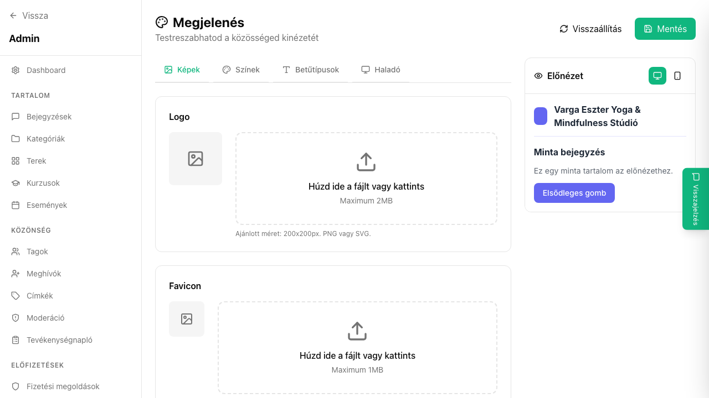

## Mi ez?

A branding beállításokkal a közösséged vizuális identitását alakíthatod ki: feltöltheted a logót, megadhatod az elsődleges brand színt, beállíthatod a favicont és – haladó felhasználóknak – egyedi CSS-sel tovább finomhangolhatod a megjelenést. A részletes lépéseket az Első lépések szekció branding cikke tartalmazza.

## Lépésről lépésre

1. Lépj be az admin felületre, és kattints a **Beállítások** → **Branding** menüpontra.
2. **Logó feltöltése:** kattints a logó területre, és töltsd fel a képfájlt (ajánlott: PNG, legalább 200×200 px, átlátszó háttér).
3. **Brand szín:** a színválasztóban add meg a hexadecimális kódot vagy kattints a palettára. Ez a szín jelenik meg a gombokon, linkeken és kiemeléseken.
4. **Favicon:** töltsd fel az ikont (ICO vagy 32×32 px PNG). Ez jelenik meg a böngésző lapfülén.
5. **Egyedi CSS** (opcionális): az erre szánt szövegmezőbe illeszthetsz be egyedi stílusokat – pl. betűtípus-csere, fejléc háttérszín módosítása.
6. Kattints a **Mentés** gombra, majd nyisd meg a közösség nyilvános oldalát egy új fülön az eredmény ellenőrzéséhez.

## Tippek

- Az egyedi CSS-ben csak felülírásokat írj – az egyutter alap stílusait ne töröld, csak felülbíráld.
- Ha a brand szín túl világos, a szöveg kontrasztja rossz lesz; ellenőrizd a WCAG AA megfelelést (pl. [webaim.org/resources/contrastchecker](https://webaim.org/resources/contrastchecker)).
- A favicont ne feledd frissíteni, ha új logót töltesz fel – böngészők sokáig cache-elik a régit.

## Kapcsolódó cikkek

- [Branding beállítása – részletes útmutató](../elso-lepesek/branding-beallitas)
- [Közösség alapadatai](./kozosseg-alapadatai)
- [SEO beállítások](./seo-beallitasok)
