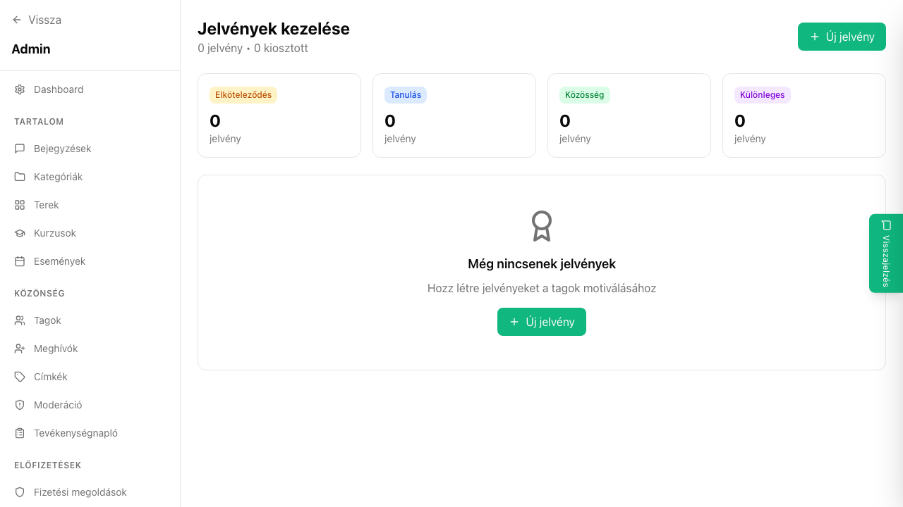

## Mi ez?

A gamifikáció rendszer célja, hogy a tagokat aktívabb részvételre ösztönözze jutalmazással. Az egyutter platformon ez elsősorban **jelvényeken (badge)** és egy közösségi **ranglistán** keresztül valósul meg.

Az adminok jelvényeket hozhatnak létre, szabályokat állíthatnak be az automatikus kiosztáshoz, vagy manuálisan adhatnak jelvényt egy-egy tagnak. A ranglista a `/leaderboard` oldalon érhető el minden tag számára.

## Lépésről lépésre

1. Navigálj az `/admin/badges` oldalra – itt találod az összes létező jelvényt.
2. Új jelvény létrehozásához kattints a **Jelvény hozzáadása** gombra, és töltsd ki a nevet, leírást, és töltsd fel az ikont.
3. Állíts be automatikus kiosztási szabályt – például:
   - Első bejegyzés publikálása
   - 10 komment írása
   - Kurzus elvégzése
   - Eseményen való részvétel
4. Ha egy tagnak manuálisan szeretnél jelvényt adni: menj a tag profiljára az `/admin/members` oldalon, kattints a nevére, majd válaszd a **Jelvény hozzáadása** opciót.
5. A kiosztott jelvények azonnal megjelennek a tag profiljában és a ranglistán is.
6. A ranglista automatikusan frissül – az aktivitás (bejegyzések, kommentek, jelvények) alapján sorolja a tagokat.

## Tippek

- Ne adj ki túl könnyen jelvényeket – ha mindenki megkapja ugyanazt, elveszti az értékét. Tervezd meg előre, milyen viselkedést szeretnél jutalmazni.
- Az **automatikus szabályok** sokkal hatékonyabbak a manuális kiosztásnál, mert folyamatosan működnek, és nem igényelnek admin beavatkozást.
- A ranglista látható minden tag számára – ez motivál, de néhány közösségben versenyszellemet is szíthat. Gondold át, hogy a közösséged kultúrájába illik-e.
- Érdemes a jelvényeket a közösség saját nyelvére, hangvételére szabni – egy egyedi név és ikon sokkal emlékezetesebb, mint egy generikus "Aktív tag" jelvény.
- Ha új jelvényt vezetsz be, jelentsd be egy bejegyzésben – ez önmagában is növeli az aktivitást.

## Kapcsolódó cikkek

- [Tagkezelés](../tagkezeles)
- [Analitika és statisztikák](./analitika)
