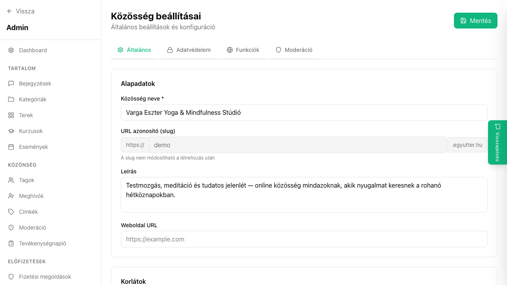

## Mi ez?

Az alapadatok tartalmazzák a közösség legfontosabb azonosító információit: a nevet, a rövid leírást, a közösség típusát (nyilvános, zárt vagy rejtett) és az időzónát. Ezek az adatok megjelennek a közösség nyilvános oldalán, a keresési találatokban és az e-mailekben.

## Lépésről lépésre

1. Lépj be az admin felületre.
2. A bal oldali menüben kattints a **Beállítások** menüpontra.
3. Az **Alapadatok** fülön módosítsd a kívánt mezőket:
   - **Közösség neve** – ez jelenik meg a fejlécben, az e-mailekben és a böngésző lapfülén
   - **Rövid leírás** – 1-2 mondatos összefoglaló; megjelenik a nyilvános oldalon és az OG-kártyákon
   - **Közösség típusa** – válassz a három lehetőség közül:
     - *Nyilvános* – bárki láthatja és csatlakozhat
     - *Zárt* – bárki láthatja, de csatlakozáshoz meghívó vagy admin jóváhagyás szükséges
     - *Rejtett* – csak meghívóval érhető el, keresőkben nem jelenik meg
   - **Időzóna** – az összes esemény és ütemezett értesítés ebben az időzónában jelenik meg
4. Kattints a **Mentés** gombra.

## Tippek

- A közösség neve után ne tegyél hosszú alcímet – a rövid, egyértelmű név jobban megjegyezhető.
- Az időzónát a tagok többségének tartózkodási helye alapján érdemes beállítani; ha globális közösséget vezetsz, az UTC megbízható alapértelmezés.
- A közösség típusát bármikor megváltoztathatod – a módosítás azonnal érvényes.
- A rövid leírás megjelenik a Google-keresési eredményekben is, ha az SEO beállításoknál nem adsz meg külön meta leírást.

## Kapcsolódó cikkek

- [SEO beállítások](./seo-beallitasok)
- [Branding és megjelenés](./branding-megjelenes)
- [Admin beállítások áttekintés](./)
