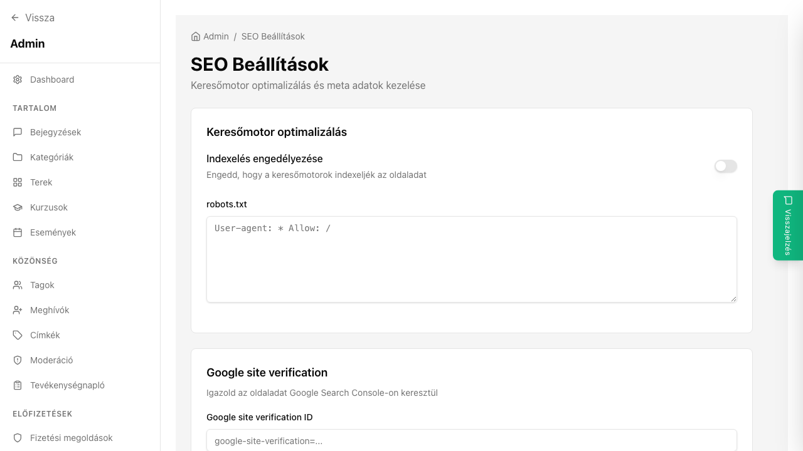

## Mi ez?

A SEO beállítások határozzák meg, hogyan jelenik meg a közösséged a Google-keresési találatokban és a közösségi médiában megosztott linkeken. Beállíthatod a meta leírást (a találat alatt megjelenő szöveget), az OG (Open Graph) képet (a link előnézetének képe), és szükség esetén felülbírálhatod a közösség nevét a meta title-ben.

## Lépésről lépésre

1. Lépj be az admin felületre.
2. A bal oldali menüben kattints a **Beállítások** menüpontra.
3. Válaszd a **SEO** fület.
4. Töltsd ki a mezőket:
   - **Meta title** – a böngésző lapfülén és a Google-találatoknál megjelenő cím; alapértelmezetten a közösség neve, de felülbírálható
   - **Meta leírás** – 150-160 karakteres összefoglaló; ez jelenik meg a Google-találat alatt és a megosztott link előnézetében
   - **OG kép** – töltsd fel a képet (ajánlott: 1200×630 px, JPG vagy PNG); ez az előnézeti kép, amely megjelenik, ha a közösség linkjét megosztják Facebookon, Twitteren, Slackon stb.
5. Kattints a **Mentés** gombra.
6. Ellenőrizd az eredményt az [opengraph.xyz](https://www.opengraph.xyz) oldalon: illeszd be a közösséged URL-jét, és nézd meg az előnézetet.

## Tippek

- A meta leírásban szerepeljenek a közösség fő témái és a célközönség – ez segíti a keresők minősítését.
- Ha a közösséged zárt (nem nyilvános), a SEO beállítások elsősorban az OG-kártyákhoz hasznosak, nem a Google-indexáláshoz.
- Az OG képet érdemes frissíteni szezonálisan (pl. kurzusindítás, esemény hirdetése előtt).
- Kerüld a 160 karakternél hosszabb meta leírásokat – a Google levágja őket.

## Kapcsolódó cikkek

- [Közösség alapadatai](./kozosseg-alapadatai)
- [Branding és megjelenés](./branding-megjelenes)
- [Egyedi domain](./egyedi-domain)
