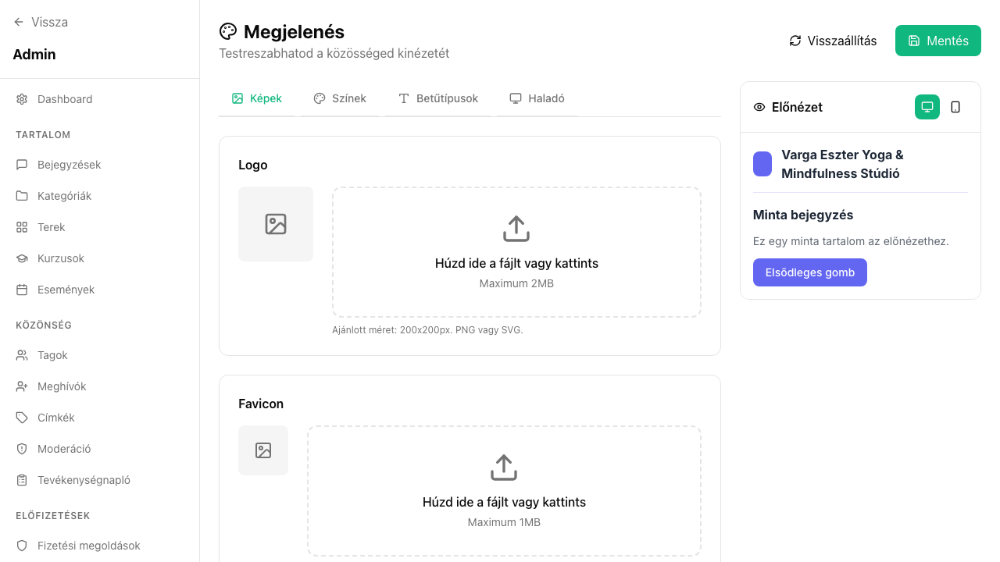

## Mi ez?

A branding beállításokkal személyre szabhatod a közösséged vizuális megjelenését: logót, brand színt és favicont adhatsz meg. Ezek az elemek megjelennek a közösséged weboldalán, a tagoknak küldött e-mailekben és a bejelentkezési oldalon is – így egységes, professzionális benyomást kelt a közösséged.

## Előfeltételek

> ⚠️ Mielőtt elkezded:
> - Admin jogosultság szükséges a branding beállítások módosításához.

## Lépésről lépésre

1. Lépj az **Admin → Branding** menüpontra.
2. **Logó feltöltése:** Kattints a logó területre, és válaszd ki a képfájlt. Ajánlott formátum: PNG vagy SVG, legalább 200×200px, átlátszó háttérrel.
3. **Brand szín:** Add meg a HEX kódot (pl. `#6366f1`). Ez a szín megjelenik a gombokban, linkekben és a navigációban.
4. **Favicon:** Tölts fel ICO vagy PNG fájlt, 32×32px méretben. Ez jelenik meg a böngészőfüleken.
5. Kattints a **Mentés** gombra – a változások azonnal érvénybe lépnek.

## Tippek

- Az SVG formátumú logó minden méretben éles és pixelmentes marad – ezt ajánljuk PNG helyett, ha lehetséges.
- A brand szín megjelenik a gombokban, linkekben és a navigációban – válassz olyan színt, amely jól olvasható fehér szöveg felett is.
- A logó megjelenik a meghívó e-mailekben is, ezért fontos, hogy minőségi, átlátszó hátterű képet tölts fel.

## Kapcsolódó cikkek

- [Egyedi domain beállítása](../admin-beallitasok/egyedi-domain)
- [E-mail sablonok](../admin-beallitasok/email-sablonok)
