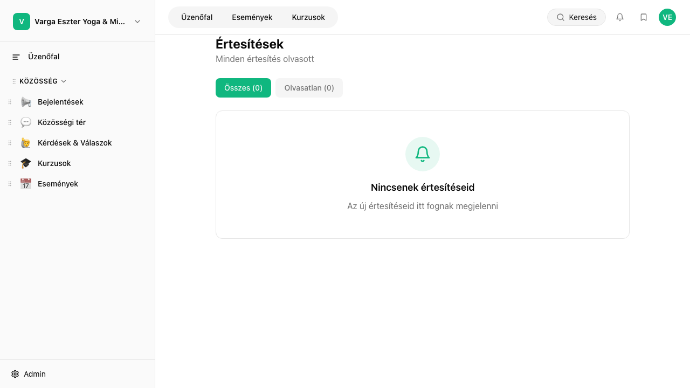

## Mi ez?

Az egyutter automatikusan küld e-mail értesítéseket különböző eseményekről – például új tag csatlakozásakor, esemény emlékeztetőként vagy a heti összefoglalóban. Adminként beállíthatod, milyen értesítések legyenek aktívak a közösség szintjén, a tagok pedig saját preferenciájuk szerint finomhangolhatják az értesítéseiket.

## Lépésről lépésre

### Adminként – közösségszintű beállítások

1. Lépj az **Admin → E-mail beállítások** oldalra.
2. Kapcsold be vagy ki az értesítéstípusokat:
   - **Új tag csatlakozásakor** – értesítés adminnak/moderátornak
   - **Heti összefoglaló** – automatikus összefoglaló e-mail a tagoknak (péntekenként)
   - **Esemény emlékeztető** – automatikus e-mail 24 órával az esemény előtt
3. Kattints a **Mentés** gombra.

### Tagként – személyes értesítési preferenciák

Minden tag a saját **Beállítások → Értesítések** oldalán szabályozhatja:
- Melyik terekből kap e-mail értesítést új bejegyzések esetén
- Kap-e heti összefoglalót
- Kap-e értesítést hozzászólásaira érkező válaszokról és @megemlítésekről

## Tippek

- A tagok csak azokból a terekből kapnak e-mail értesítést, amelyekre feliratkoztak a saját beállításaikban – ez csökkenti az értesítési zajt.
- A heti összefoglaló automatikusan a legaktívabb tartalmakat gyűjti össze – hasznos eszköz a tagok visszacsábítására.
- Az esemény emlékeztető e-mail nem kapcsolható ki tagszinten – ez garantálja, hogy mindenki megkapja a fontos emlékeztetőket.

## Kapcsolódó cikkek

- [Közvetlen üzenetek](./kozvetlen-uzenetek)
- [Közlemények](./kozlemenyek)
- [Heti összefoglaló](./heti-osszefoglalo)
