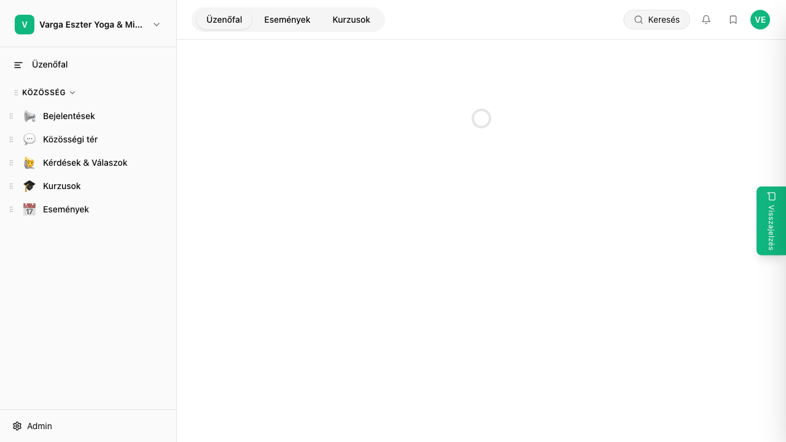

## Mi ez?

A @mention funkcióval bármelyik tag nevét beírhatod egy posztba vagy kommentbe az `@` jel segítségével. A megemlített tag azonnal – in-app értesítést és opcionálisan e-mailt is – kap, így biztosan nem marad le a neki szóló üzenetről. A @mention hasznos, ha konkrét személyt szeretnél bevonni egy témába, kérdést tennél fel valakinek, vagy köszönetet mondanál.

## Lépésről lépésre

1. Nyiss egy új posztot vagy kezdj el írni egy kommentet.
2. Gépeld be a `@` jelet – megjelenik egy legördülő kereső.
3. Kezdd el gépelni a megemlíteni kívánt tag nevét.
4. Válaszd ki a megfelelő tagot a listából.
5. Folytasd az írást – a megemlített név kiemelten jelenik meg a szövegben.
6. Tedd közzé a posztot vagy kommentet – az érintett tag azonnal értesítést kap.

**Ki kap értesítést?**

- Minden `@`-jellel megemlített tag értesítést kap in-app és – ha nincs kikapcsolva – e-mailben is.
- Ha valaki letiltotta az e-mail értesítéseket, az in-app értesítés akkor is megjelenik – a @mention értesítés nem tiltható le teljesen.

## Tippek

- Egyszerre több tagot is megemlíthetsz egyetlen posztban vagy kommentben.
- Ha nem találod a keresett tagot a @mention listában, ellenőrizd, hogy a tag valóban tagja-e a közösségnek – külső személyek nem jelennek meg a listában.
- Kerüld a felesleges @mention-öket: ha rendszeresen „zajként" élik meg a tagok, kevésbé figyelnek rá. Csak akkor mention-öld valakifik, ha valóban szükséges a bevonásuk.

## Kapcsolódó cikkek

- [In-app értesítések](./in-app-ertesitesek)
- [E-mail értesítések](./email-ertesitesek)
- [Közvetlen üzenetek](./kozvetlen-uzenetek)
