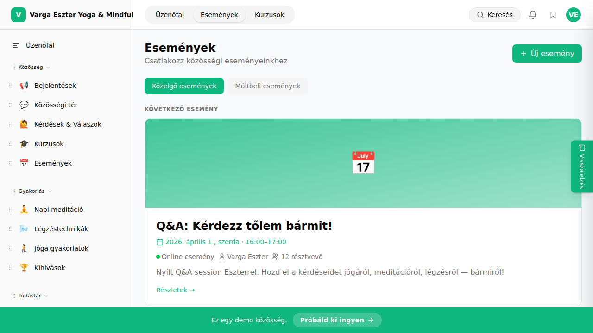

## Mi ez?

Minden eseménynél nyomon követheted, kik jelezték részvételi szándékukat RSVP-vel. A résztvevői listát megtekintheted az admin felületen, és CSV-formátumban exportálhatod – például emlékeztető e-mailek küldéséhez vagy jelenléti ív készítéséhez.

## Lépésről lépésre

1. Lépj az **Admin → Események** oldalra.
2. Kattints az esemény nevére a listában.
3. Görgess le a **„Résztvevők"** szekcióhoz.
4. Láthatod az összes tagot, aki RSVP-vel jelezte részvételi szándékát – nevükkel, e-mail-jükkel és a jelzés dátumával.
5. A **„Exportálás"** gombbal CSV-formátumban letöltheted a listát.

## Tippek

- **Maximális létszám** beállítható az esemény szerkesztőben – ha betelt, a tagok nem tudnak RSVP-zni, és várólistán helyezkednek el.
- A résztvevők listája valós időben frissül – nem kell manuálisan frissíteni az oldalt.
- Az exportált CSV tartalmazza a tag nevét, e-mail-jét és a regisztráció dátumát – ez közvetlenül importálható e-mail eszközökbe.

## Kapcsolódó cikkek

- [Esemény létrehozása](./esemeny-letrehozasa)
- [Esemény emlékeztetők](./emlekeztetok)
