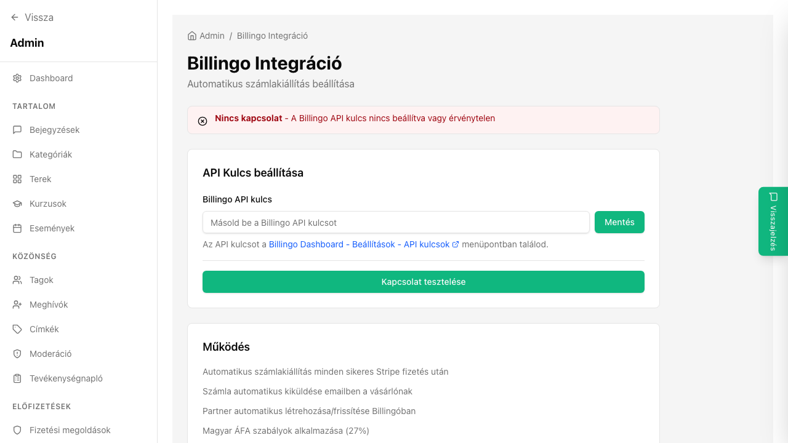

## Mi ez?

A Billingo integráció lehetővé teszi, hogy minden sikeres fizetés után automatikusan kiálljon a számla a vásárló nevére. A számlát a Billingo rendszere állítja ki és küldi el e-mailben a vevőnek – neked csak az API kulcsot kell megadni, a többit az egyutter elvégzi.

Ez különösen fontos magyar vevőknél, ahol a számlakiállítás törvényi kötelezettség.

**Előfeltétel:** Aktív Billingo fiók (billingo.hu) és legalább egy konfigurált számlatömb.

## Lépésről lépésre

1. Nyisd meg a [Billingo](https://app.billingo.hu) admin felületet.
2. Lépj a **Beállítások → API** menübe.
3. Hozz létre egy új API kulcsot, és másold ki.
4. Az egyutter **Admin paneljén** nyisd meg az **Integrációk** menüpontot.
5. Keresd meg a **Billingo** integrációt, és kattints a **Beállítás** gombra.
6. Illeszd be az API kulcsot a megfelelő mezőbe.
7. Válaszd ki, melyik **számlatömböt** használja az egyutter (ha több számlatömböd van Billingóban).
8. Állítsd be a **termékek nevét** – ez jelenik meg a számlán tételként (pl. „Egyutter havi előfizetés").
9. Mentsd el a beállításokat.
10. Tesztelj egy valós vagy Stripe teszt-fizetéssel – a kiállított számlát a Billingo felületen ellenőrizheted.

## Tippek

- A vevő neve és e-mail-címe automatikusan átkerül az egyutterből Billingóba – a tagnak nem kell külön adatot megadnia, ha a profilján szerepel a neve.
- Ha a vevő céges számlát szeretne, adj hozzá a checkout folyamathoz egy „Cégnév / adószám" mezőt – ezt a Billingo is átveszi.
- A számla kiállítása aszinkron történik – néhány perccel a fizetés után érkezik meg a vevőnek.
- Ha hibás számlát állítottál ki, azt közvetlenül a Billingo felületen sztornózhatod.

## Kapcsolódó cikkek

- [Stripe beállítása](./stripe-beallitas)
- [Előfizetési csomagok](./elofizetesi-csomagok)
- [Fizetési riportok](./fizetesi-riportok)
