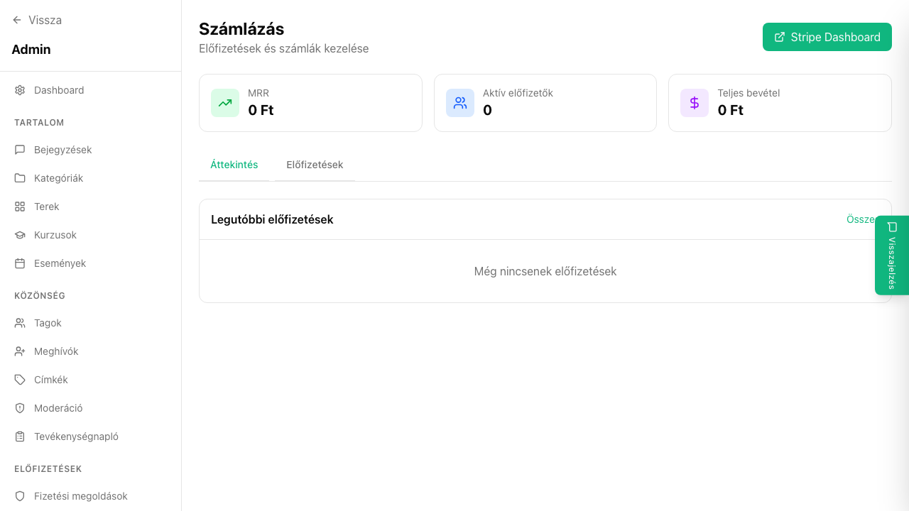

## Mi ez?

Az előfizetési csomagok az árképzési terveid – meghatározod, mennyiért és milyen időszakra (havi, éves, egyszeri) férhetnek hozzá a tagok a fizetős tartalmakhoz. Egyszerre több csomag is aktív lehet: pl. egy havi és egy éves opció párhuzamosan.

## Előfeltételek

> ⚠️ Mielőtt elkezded:
> - A Stripe-nak összekapcsoltnak kell lennie. Lásd: [Stripe beállítása és összekapcsolása](./stripe-beallitas).

## Lépésről lépésre

1. Lépj az **Admin → Előfizetések** oldalra.
2. Kattints az **„Új csomag"** gombra.
3. Add meg:
   - **Név** (pl. „Havi tagság" vagy „Éves Pro csomag")
   - **Leírás** – ez megjelenik a fizetési oldalon
   - **Ár** – forintban (Ft) vagy euróban (EUR) megadva
4. Válaszd ki a **számlázási időszakot:**
   - **Havi** – visszatérő havi fizetés
   - **Éves** – visszatérő éves fizetés (kedvezmény adható)
   - **Egyszeri** – egyszeri vásárlás, örökre szóló hozzáféréssel
5. Kattints a **Mentés** gombra.

## Tippek

- Éves csomaghoz kedvezmény állítható be – mutasd meg a tagoknak, mennyit spórolnak az éves előfizetéssel a havihoz képest.
- Egyszerre több csomag is aktiválható – pl. egy havi és egy éves lehetőség is kínálható párhuzamosan.
- A csomag törlése nem törli az aktív előfizetőket – ők a következő megújítási időpontig hozzáférnek a tartalmakhoz.

## Kapcsolódó cikkek

- [Paywall konfigurálása](./paywall)
- [Fizetős kurzus beállítása](../kurzusok/fizetos-kurzus)
