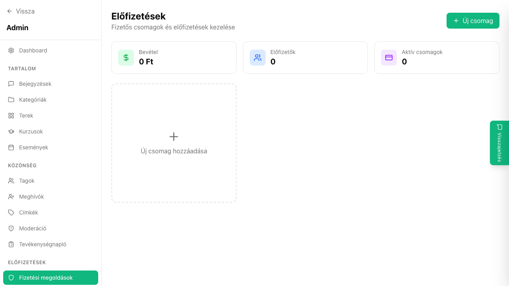

## Mi ez?

A paywall egy hozzáférési korlát, amellyel meghatározhatod, hogy egyes tartalmak (terek, kurzusok) csak aktív előfizetőknek legyenek elérhetők. A nem fizető tagok helyett egy testreszabható üzenetet látnak, amely felszólítja őket az előfizetés megvásárlására.

## Előfeltételek

> ⚠️ Mielőtt elkezded:
> - A Stripe-nak összekapcsoltnak kell lennie. Lásd: [Stripe beállítása](./stripe-beallitas).
> - Legalább egy előfizetési csomagnak léteznie kell. Lásd: [Előfizetési csomagok](./elofizetesi-csomagok).

## Lépésről lépésre

1. Lépj az **Admin → Paywall** oldalra.
2. Kattints az **„Új paywall"** gombra.
3. Válaszd ki a **korlátozott tartalmat** – tér, kurzus vagy más tartalom.
4. Rendeld hozzá a szükséges **előfizetési csomagot** (vagy csomagokat).
5. Opcionálisan testreszabd a **megjelenő üzenetet** – ezt látják a nem előfizetők.
6. Kattints a **Mentés** gombra.

## Tippek

- Egy tartalomhoz **több csomag is hozzárendelhető** – pl. ha havi és éves csomagod is van, mindkettő hozzáférést adhat ugyanahhoz a térhez.
- A megjelenő üzenet testreszabható – érdemes motiváló, értékalapú szöveget írni, amely elmagyarázza, mit kap a tag az előfizetéssel.
- Ingyenes próbaidőszak esetén beállíthatod, hogy az első 7 nap paywall nélkül elérhető legyen.

## Kapcsolódó cikkek

- [Előfizetési csomagok létrehozása](./elofizetesi-csomagok)
- [Stripe beállítása és összekapcsolása](./stripe-beallitas)
