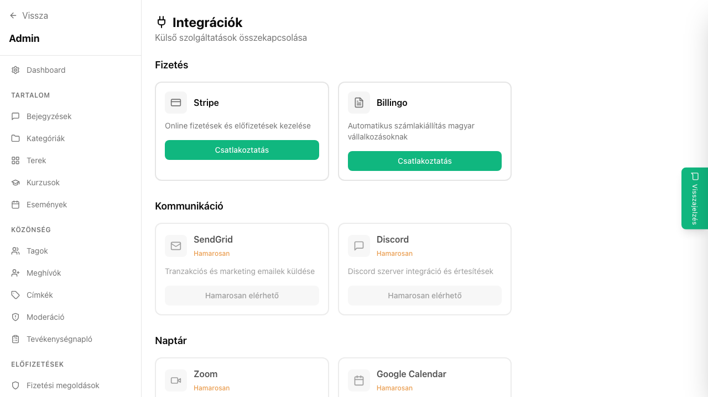

## Mi ez?

Az egyutter automatizálási platformokon és közvetlen API összekötőkön keresztül csatlakoztatható külső eszközökhöz. A leggyakoribb integrációk:

- **Zapier** – 6000+ alkalmazással kötheted össze az egyuttert, kód nélkül.
- **Make (Integromat)** – vizuális, komplex automatizálási folyamatok felépítésére.
- **ActiveCampaign** – CRM és e-mail automatizálás összekötése a tagsági adatokkal.
- **Mailchimp** – e-mail listák szinkronizálása az egyutter tagjaival.

Ezek az integrációk jellemzően webhookon vagy az egyutter API-ján keresztül működnek.

## Lépésről lépésre

### Zapier összekötése

1. Nyisd meg a [Zapier](https://zapier.com) felületet, és hozz létre egy új Zap-ot.
2. Keresőbe írd be: **Egyutter** – vagy válaszd a **Webhooks by Zapier** triggert, ha nincs natív összekötő.
3. Az egyutter oldalán menj az **Admin → Integrációk → API kulcsok** menübe, és hozz létre egy új API kulcsot.
4. Illeszd be az API kulcsot a Zapierbe a hitelesítési lépésnél.
5. Válaszd ki a triggert (pl. „Új tag csatlakozott", „Előfizetés létrejött").
6. Állítsd be az akciót a céllalkalmazásban (pl. sor hozzáadása Google Sheetshez, kapcsolat létrehozása CRM-ben).
7. Teszteld és aktiváld a Zap-ot.

### Make (Integromat) összekötése

1. Nyisd meg a [Make](https://make.com) felületet, és hozz létre egy új scenariót.
2. Add hozzá a **Webhook** modult triggerként, és másold ki a webhook URL-t.
3. Az egyutter **Admin → Integrációk → Webhookok** menüjében add meg ezt az URL-t, és válaszd ki, melyik esemény triggerelje (pl. új fizetés, tag lemondása).
4. Futtass egy teszt-eseményt az egyutterben, hogy a Make megkapja az adatstruktúrát.
5. Építsd fel a Make scenariót a fogadott adatok alapján.

### ActiveCampaign összekötése

1. Az ActiveCampaign fiókodban lépj a **Settings → Developer** menübe, és másold ki az API URL-t és kulcsot.
2. Az egyutterben menj az **Admin → Integrációk → ActiveCampaign** menübe (ha rendelkezésre áll natív integráció).
3. Illeszd be az API adatokat, és válaszd ki, melyik ActiveCampaign listára kerüljenek az új tagok.
4. Opcionálisan: Zapier vagy Make segítségével finomabb szegmentálást is megvalósíthatsz (pl. az előfizetési csomag alapján más listára kerül a tag).

### Mailchimp összekötése

1. A Mailchimp fiókodban lépj a **Profile → Extras → API keys** menübe, és hozz létre egy API kulcsot.
2. Az egyutterben (vagy Zapieren keresztül) add meg a Mailchimp API kulcsot.
3. Határozd meg a szinkronizálás irányát:
   - Új egyutter tag → feliratkozás Mailchimp listára
   - Tag lemondása → leiratkozás vagy tag frissítése Mailchimpben
4. Teszteld egy teszt-taggal, hogy az e-mail cím megjelenik-e a Mailchimp listán.

## Tippek

- Ha az egyutter és a külső eszköz között kétirányú szinkronizálást szeretnél, ügyelj a végtelen ciklus elkerülésére (pl. ne triggerelj visszaírásnál ismét).
- Az API kulcsokat rendszeresen rotáld, és minden integrációhoz külön kulcsot hozz létre – így egy esetleges kiszivárgás esetén csak az adott integrációt kell letiltani.
- Make (Integromat) erősebb komplex folyamatoknál, míg Zapier egyszerűbb, gyorsabb beállításoknál ajánlott.
- Ha egy integráció nem működik, először a webhook naplókat ellenőrizd: **Admin → Integrációk → Webhook napló**.

## Kapcsolódó cikkek

- [API kulcsok](./api-kulcsok)
- [Webhook integráció](./webhook-integracio)
- [Integrációk áttekintő](../integraciok)
