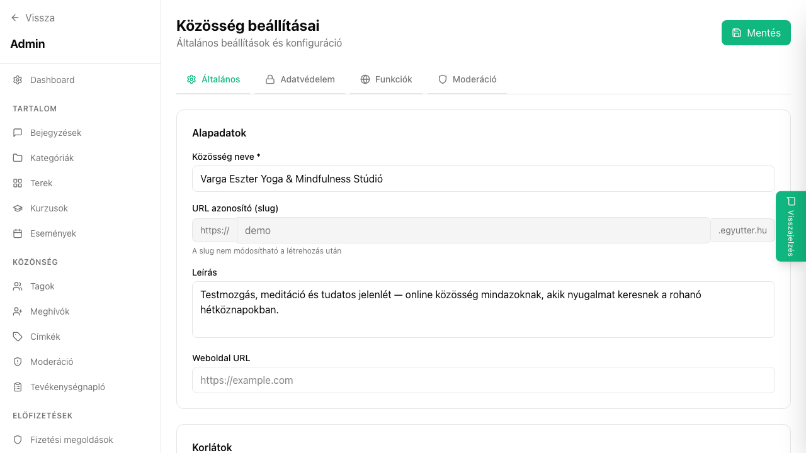

## Mi ez?

A webhook egy automatikus értesítési mechanizmus: amikor az egyutter platformon valami történik – például új tag regisztrál, beérkezett egy fizetés, vagy valaki befejezett egy kurzust –, a rendszer azonnal küld egy POST kérést egy általad megadott URL-re. Ez az URL lehet egy Zapier-folyamat, egy Make-forgatókönyv, egy saját szervered, vagy bármilyen eszköz, amely képes HTTP kéréseket fogadni.

A webhookok lényege, hogy nem kell folyamatosan lekérdezni az egyutter API-ját – az esemény pillanatában érkezik az adat a saját rendszeredbe.

## Lépésről lépésre

1. Lépj be az adminfelületre, és nyisd meg az `/admin/integrations` oldalt.
2. Kattints a **Webhookok** fülre vagy szekcióra.
3. Kattints az **Új webhook hozzáadása** gombra.
4. Add meg a **célURL-t** – ez az a cím, ahová az egyutter elküldi az adatokat (pl. a Zapier „Catch Hook" lépésének URL-je).
5. Válaszd ki, **milyen eseményekre** szeretnél értesítést kapni. Például:
   - Új tag regisztrált
   - Fizetés érkezett
   - Kurzus befejezve
   - Bejegyzés közzétéve
6. Kattints a **Mentés** gombra.
7. A webhook azonnal aktív – teszteld el a beállítások oldalon található **Teszt küldése** gombbal, hogy meggyőződj a kapcsolat működéséről.

Ha egy webhookot le szeretnél állítani, egyszerűen kapcsold ki a mellette lévő kapcsolóval, vagy töröld a listából.

## Tippek

- **Mindig teszteld beállítás után** – a teszt funkció valódi POST kérést küld az URL-re, így azonnal látod, hogy a fogadó oldal megfelelően reagál-e.
- **Figyeld a válaszkódokat** – az egyutter naplózza a webhook-kérések eredményét. Ha a fogadó oldal nem 2xx státuszkóddal válaszol, az hibának minősül.
- **Zapiernél és Make-nél** a webhook URL-t a folyamat első lépéseként kell létrehozni, mielőtt az egyutterben megadod – így lesz kész URL-ed, amit be tudsz illeszteni.
- **Tesztkörnyezethez** használj olyan eszközt, mint a [webhook.site](https://webhook.site) – ez egy ingyenes, ideiglenes URL, ahol élőben látod a beérkező adatokat.
- Ha egyszerre több eseményre is szeretnél reagálni, mindegyikhez beállíthatsz **külön webhookot**, vagy ha az eszközöd támogatja, egyetlen URL-re is érkezhetnek különböző eseménytípusok – az esemény típusát az egyutter a kérés törzsében (`event` mező) adja meg.

## Kapcsolódó cikkek

- [API kulcsok kezelése](./api-kulcsok)
- [Harmadik fél integrációk](./harmadik-fel-integraciok)
- [Webhook beállítások az adminfelületen](../admin-beallitasok/webhookok)
