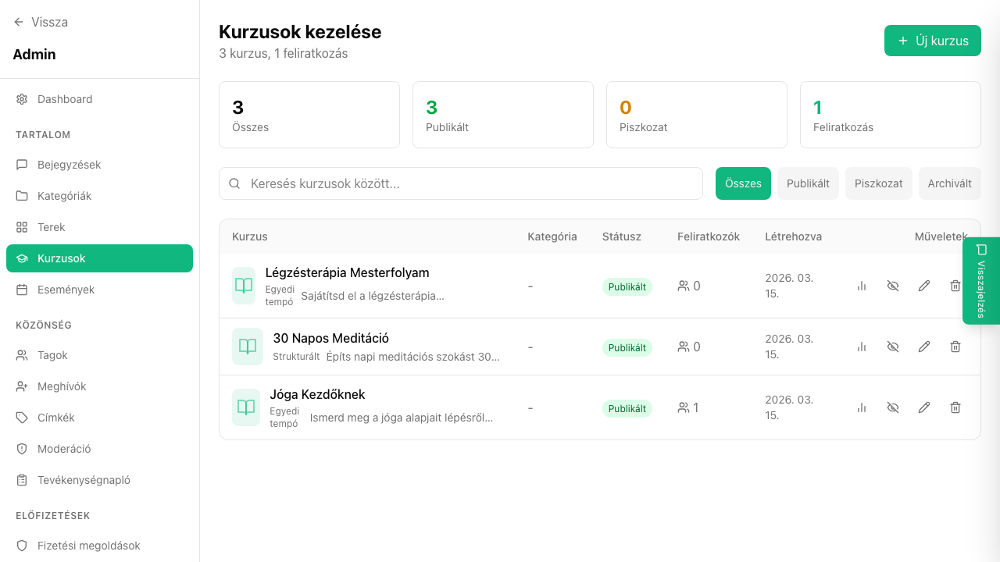

## Mi ez?

A drip tartalom funkció lehetővé teszi, hogy a kurzus leckéi ne egyszerre legyenek elérhetők, hanem fokozatosan – a beiratkozástól számított meghatározott számú nappal – nyíljanak meg. Például az első fejezet azonnal elérhető, a második 7 nappal a beiratkozás után, a harmadik 14 nappal, és így tovább.

Ez a megközelítés hasznos, ha:
- kohort-alapú programot vezetsz, ahol mindenki egyszerre halad,
- el akarod kerülni, hogy a tagok átugorják az anyagot,
- hetente új tartalommal szeretnéd visszahozni a tagokat.

## Lépésről lépésre

1. Nyisd meg az **Admin panelt**, majd kattints a **Kurzusok** menüpontra.
2. Válaszd ki a kívánt kurzust, majd kattints a **Szerkesztés** gombra.
3. A kurzusszerkesztőben lépj a **Beállítások** fülre.
4. Keresd meg a **Tartalom feloldása** vagy **Drip beállítások** részt.
5. Kapcsold be a **Drip tartalom** kapcsolót.
6. Minden fejezetnél vagy leckénél add meg, hogy hány nappal a beiratkozás után váljon elérhetővé.
   - 0 nap = azonnal elérhető
   - 7 nap = beiratkozás után 1 héttel nyílik meg
7. Mentsd el a változtatásokat a **Mentés** gombbal.
8. Teszteld egy teszttag fiókkal, hogy a feloldás a beállított ütemterv szerint működik-e.

## Tippek

- A drip beállítás leckénként és fejezetenként is megadható – nem kell az egész kurzusra egységes ütemet alkalmazni.
- Ha egy tagnak kivételesen korábban kellene hozzáférnie, az **Admin → Tagok → [Tag neve] → Kurzus-hozzáférés** menüben manuálisan feloldhatod.
- A drip számítás mindig a **beiratkozás dátumától** indul, nem a kurzus indulásától.
- Módosítás esetén a már beiratkozott tagokra az új ütemterv csak akkor lép életbe, ha ezt expliciten engedélyezed a beállításokban.

## Kapcsolódó cikkek

- [Fejezetek és leckék](./fejezetek-leckek)
- [Hallgatói lista](./hallgatoi-lista)
- [Kurzus létrehozása](./kurzus-letrehozasa)
