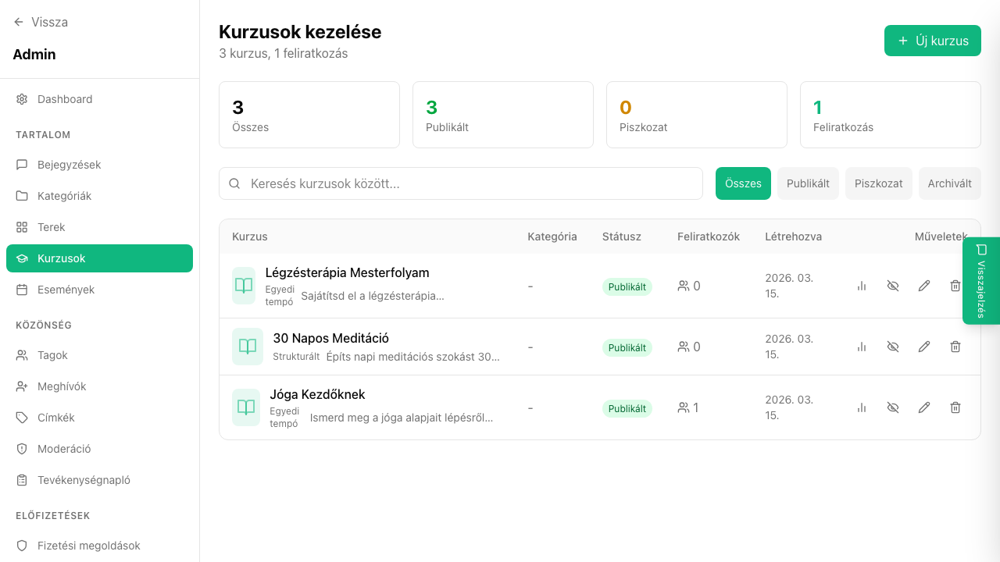

## Mi ez?

A hallgatói listán átfogó képet kaphatsz a kurzusodon tanuló tagokról: láthatod, ki iratkozott fel, mekkora a teljesítési százalékuk, mikor volt utoljára aktív, és milyen kvíz eredményeket értek el. Ez segít azonosítani, kik szorulnak esetleg extra segítségre, és hogy a tananyag melyik részénél akadnak el a hallgatók.

## Lépésről lépésre

1. Lépj az **Admin → Kurzusok** oldalra.
2. Kattints a kurzus nevére.
3. Válaszd a **„Hallgatók"** fület a kurzus fejlécén belül.
4. Az összefoglaló listán látható:
   - A feliratkozott tag neve és e-mail-je
   - **Teljesítési százalék** (hány leckét teljesített)
   - **Utolsó aktivitás** dátuma
5. Egy hallgató nevére kattintva megnyílik a **részletes haladásnézet** – láthatod leckénként, hogy teljesítette-e, és ha volt kvíze, azt hány ponttal teljesítette.

## Tippek

- A hallgatói lista **CSV-formátumban exportálható** az „Exportálás" gombbal – hasznos riportokhoz vagy e-mail kampányokhoz.
- Ha egy hallgató elakadt (pl. hetekig nincs aktivitás), közvetlenül az admin felületről küldhet nekik üzenetet.
- A kvíz eredmények részletei szintén elérhetők a hallgató részletes nézetéből.

## Kapcsolódó cikkek

- [Kvízek és tesztek](./kvizek)
- [Kurzus létrehozása](./kurzus-letrehozasa)
