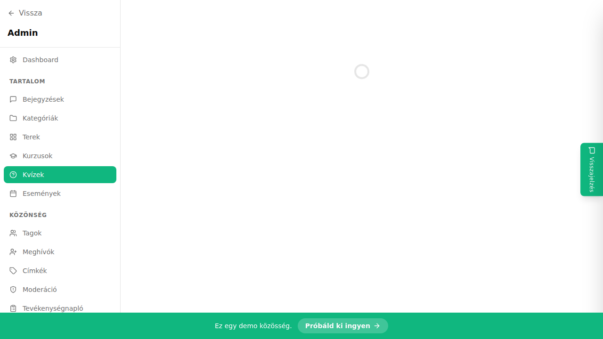

## Mi ez?

A kvízek segítségével ellenőrizheted, hogy a hallgatók elsajátították-e a lecke anyagát. Beállíthatsz minimális pontszámot (átmenési küszöb), és a hallgatók korlátlan számban próbálkozhatnak újra. Az eredmény azonnal megjelenik a beküldés után, és adminként részletes statisztikákat látsz.

## Lépésről lépésre

### Kvíz létrehozása

1. Lépj az **Admin → Kvízek** oldalra.
2. Kattints az **„Új kvíz"** gombra.
3. Add meg a kvíz **nevét** és az **átmenési küszöböt** (pl. 70% – ennyi helyes válasz szükséges az átmenéshez).
4. Kattints a **„+ Kérdés hozzáadása"** gombra, majd:
   - Írd be a **kérdést.**
   - Add meg a **válaszlehetőségeket** (minimum 2, maximum 6).
   - Jelöld be a **helyes választ** (vagy válaszokat, ha több is helyes).
5. Adj hozzá annyi kérdést, amennyit szeretnél.
6. Kattints a **Mentés** gombra.

### Kvíz hozzárendelése leckéhez

1. Nyisd meg a leckét szerkesztésre.
2. Görgess le a **„Kvíz hozzárendelése"** szekcióhoz.
3. Válaszd ki a kívánt kvízt a legördülő listából.
4. Mentés.

### Eredmények megtekintése

1. **Admin → Kurzusok → lecke → Kvíz eredmények.**
2. Láthatod az összes próbálkozást, elért pontszámokat és helyes válaszokat hallgatónként.

## Tippek

- Az eredmény azonnal megjelenik a hallgató számára a beküldés után – nem kell manuálisan értékelni.
- Ha a hallgató nem éri el az átmenési küszöböt, újra próbálkozhat anélkül, hogy az admin beavatkozna.
- A kvíz-kérdések sorrendje véletlenszerűsíthető – ez csökkenti a másolás esélyét.

## Kapcsolódó cikkek

- [Hallgatói lista és haladáskövetés](./hallgatoi-lista)
- [Fejezetek és leckék szervezése](./fejezetek-leckek)
