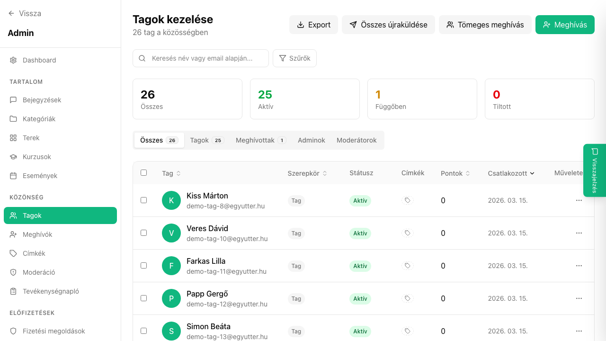

## Mi ez?

Az egyutter három alapvető szerepkört támogat: Admin (teljes hozzáférés), Moderátor (tartalom kezelés és moderáció), Tag (olvasás és részvétel). A megfelelő szerepkör kiosztásával biztosíthatod, hogy mindenki csak azokhoz a funkciókhoz férjen hozzá, amelyek az ő feladatához szükségesek.

## Jogosultságok összehasonlítása

| Funkció | Admin | Moderátor | Tag |
|---|---|---|---|
| Közösség beállítások | ✅ | ❌ | ❌ |
| Tartalom törlése | ✅ | ✅ | ❌ |
| Tagok kitiltása | ✅ | ✅ | ❌ |
| Kurzusok kezelése | ✅ | ❌ | ❌ |
| Bejegyzések írása | ✅ | ✅ | ✅ |
| Hozzászólás | ✅ | ✅ | ✅ |
| Meghívók küldése | ✅ | ✅ | ❌ |
| Fizetési beállítások | ✅ | ❌ | ❌ |

## Lépésről lépésre

### Szerepkör módosítása

1. Lépj az **Admin → Tagok** oldalra.
2. Keresd meg a tagot, akinek szerepkörét módosítani szeretnéd.
3. Kattints a tag melletti **···** gombra.
4. Válaszd a **„Szerepkör módosítása"** opciót.
5. Válaszd ki az új szerepkört (Admin / Moderátor / Tag).
6. Kattints a **Mentés** gombra.

## Tippek

- Egy közösségnek több adminisztrátora is lehet – érdemes legalább egy megbízható társt adminnak megjelölni.
- A moderátor szerepkör ideális azoknak, akik segítenek a tartalom moderálásában, de nem szükséges, hogy az összes beállításhoz hozzáférjenek.
- Az egyetlen adminisztrátor nem távolíthatja el saját adminisztrátori jogosultságát – előbb ki kell jelölni egy másik admint.

## Kapcsolódó cikkek

- [Moderáció és kitiltás](./moderacio)
- [Tag szegmensek](./tag-szegmensek)
