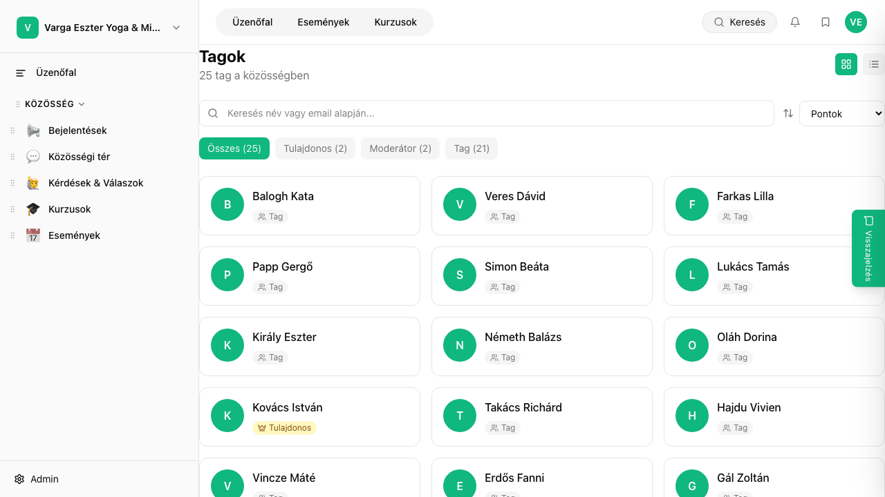

## Mi ez?

A tag directory egy áttekintő nézet a közösség összes tagjáról. Minden tag láthatja, kik tartoznak a közösséghez – profilképpel, névvel és szerepkörrel. Adminként ezen felül szűrhetsz is, és gyorsan megtalálhatod a keresett tagot.

A tag directory a `/members` útvonalon érhető el, és minden bejelentkezett tag számára látható.

## Lépésről lépésre

1. Navigálj a `/members` oldalra – megjelenik a tagok listája profilképpel, névvel és szerepkörrel (pl. Admin, Tag, Moderátor).
2. A keresőmezőbe gépeléssel szűrheted a listát név szerint – hasznos, ha nagy a közösség.
3. Kattints egy tag nevére vagy profilképére a részletes profil megtekintéséhez. A profiloldalon látható:
   - Bio (ha a tag kitöltötte)
   - Csatlakozás dátuma
   - Aktivitási összefoglaló (bejegyzések, kommentek száma)
   - Megszerzett jelvények (ha a gamifikáció be van kapcsolva)
4. Adminként az `/admin/members` oldalon szűrhetsz **szerepkör** (Admin / Moderátor / Tag) vagy **státusz** (aktív / felfüggesztett) szerint is.
5. Ha egy tag profiljára kattintasz az admin nézetben, eléred a teljes adminisztrációs eszközkészletet: szerepkör módosítás, jelvény hozzáadása, tag felfüggesztése.

## Tippek

- A tag directory nyilvános a közösségen belül – minden bejelentkezett tag látja a többi tagot. Ha valaki nem szeretné megjeleníteni a profilját, ezt a saját beállításaiban kezelheti.
- Az **aktivitási összefoglaló** hasznos jelzőszám: ha valaki már régóta tag, de keveset publikál, érdemes megszólítani.
- Adminként érdemes időnként átfutni a listát, és megnézni, ki nem töltötte ki a bio-ját – egy személyes üzenet sokat segíthet a beilleszkedésben.
- A tagok **kereshetők név szerint**, de egyéb szűrők (pl. érdeklődési kör, helyszín) jelenleg nem elérhetők a publikus nézetben.
- Ha egy tagot fel kell függesztened vagy törölnöd kell, azt az `/admin/members` oldalon teheted meg – a publikus `/members` oldalról nem elérhető ez a funkció.

## Kapcsolódó cikkek

- [Szerepkörök és jogosultságok](./szerepkorok-jogosultsagok)
- [Tömeges meghívó küldése](./tomeg-meghivo)
