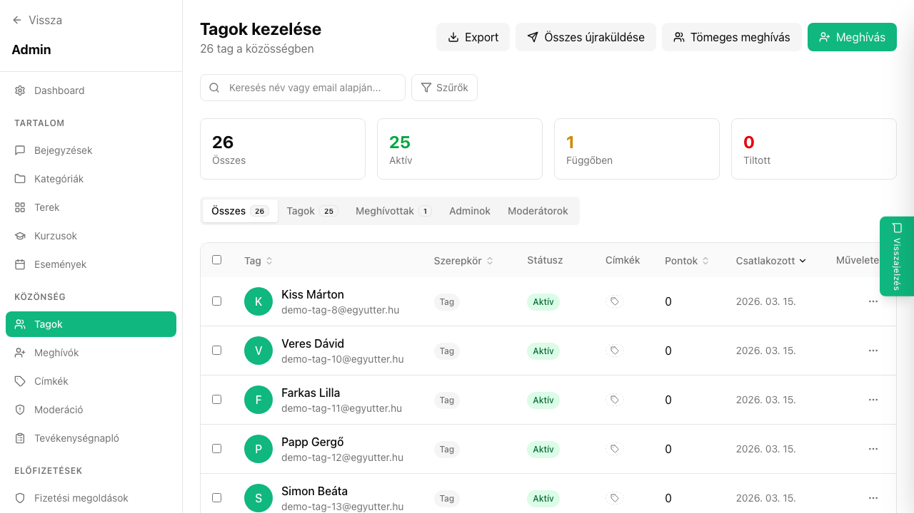

## Mi ez?

A tag export funkcióval egy kattintással letöltheted a közösséged összes tagjának adatait CSV formátumban. Az exportált fájl tartalmazza a tagok nevét, e-mail-címét, szerepkörét, csatlakozás dátumát és egyéb profiladatokat. Ez hasznos külső CRM-ek, hírlevél rendszerek (pl. Mailchimp, ActiveCampaign) vagy saját adatbázis szinkronizálásához.

## Lépésről lépésre

1. Lépj az **Admin → Tagok** oldalra.
2. Opcionálisan alkalmazz szűrőket, ha csak bizonyos tagokat szeretnél exportálni (pl. egy adott szerepkör szerint).
3. Kattints a jobb felső sarokban lévő **„Export"** gombra.
4. Erősítsd meg a letöltést a megjelenő párbeszédablakban.
5. A CSV fájl automatikusan letöltődik a böngésződbe.

## Tippek

- A CSV-ben minden mező pontosvesszővel van elválasztva – importálás előtt ellenőrizd, hogy a célrendszered ezt az elválasztót várja-e.
- Ha csak aktív tagokat szeretnél exportálni, a szűrőkkel előbb szűkítsd le a listát, majd exportálj – az export mindig az aktuálisan látható listát tölti le.
- Rendszeres exportálással naprakészen tarthatod a külső hírlevél listádat; a duplikációk elkerülése érdekében érdemes a célrendszerben e-mail-cím alapú egyeztetést beállítani.

## Kapcsolódó cikkek

- [Tag szegmensek](./tag-szegmensek)
- [Tömeges meghívás – CSV feltöltés](./tomeg-meghivo)
- [Tag directory és profilok](./tag-directory-profilok)
