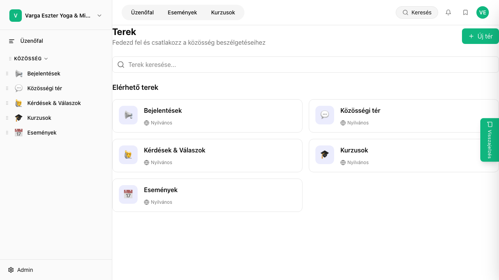

## Mi ez?

A bejegyzések a terek fő tartalmai – szöveges posztok, amelyekhez tagok hozzászólhatnak és reakciókat adhatnak. Adminként létrehozhatsz, szerkeszthetsz, törölhetsz és ütemezve is közzétehetsz bejegyzéseket. Tagok szintén írhatnak bejegyzéseket a számukra nyitott terekben.

## Lépésről lépésre

### Bejegyzés létrehozása

1. Navigálj a kívánt térbe a bal oldali navigációban.
2. Kattints a **„Bejegyzés írása"** gombra (feed tetején).
3. Írd meg a tartalmat a rich text szerkesztőben – formázás, linkek és képek is hozzáadhatók.
4. Opcionálisan adj meg **kategóriát** és **címkéket** a könnyebb kereshetőség érdekében.
5. Kattints a **Közzététel** gombra.

### Ütemezett közzététel

1. A bejegyzés megírása után kattints a **Közzététel** gomb melletti **nyílra**.
2. Válaszd az **„Ütemezés"** lehetőséget.
3. Add meg a közzététel **dátumát és időpontját.**
4. Kattints az **„Ütemezés"** gombra – a bejegyzés a megadott időpontban automatikusan megjelenik.

### Bejegyzés szerkesztése és törlése

- Bejegyzésen kattints a **···** menüre (jobb felső sarok) → **Szerkesztés** vagy **Törlés.**
- Piszkozatok megtekintése: **„Összes bejegyzés"** nézet → **„Piszkozatok"** szűrő.

## Tippek

- Piszkozatként mentett bejegyzések nem láthatók a tagok számára – nyugodtan dolgozhatsz rajtuk több menetben.
- Ütemezés törlése: az ütemezett bejegyzésnél kattints a **···** → **„Ütemezés visszavonása"** – piszkozatként megmarad.
- Kategóriák és címkék beállításával a tagok könnyebben megtalálják a releváns tartalmakat.

## Kapcsolódó cikkek

- [Kategóriák és címkék](./kategoriak-cimkek)
- [Ütemezett bejegyzések](./utemezett-bejegyzesek)
- [Tér létrehozása és beállítása](./ter-letrehozasa)
